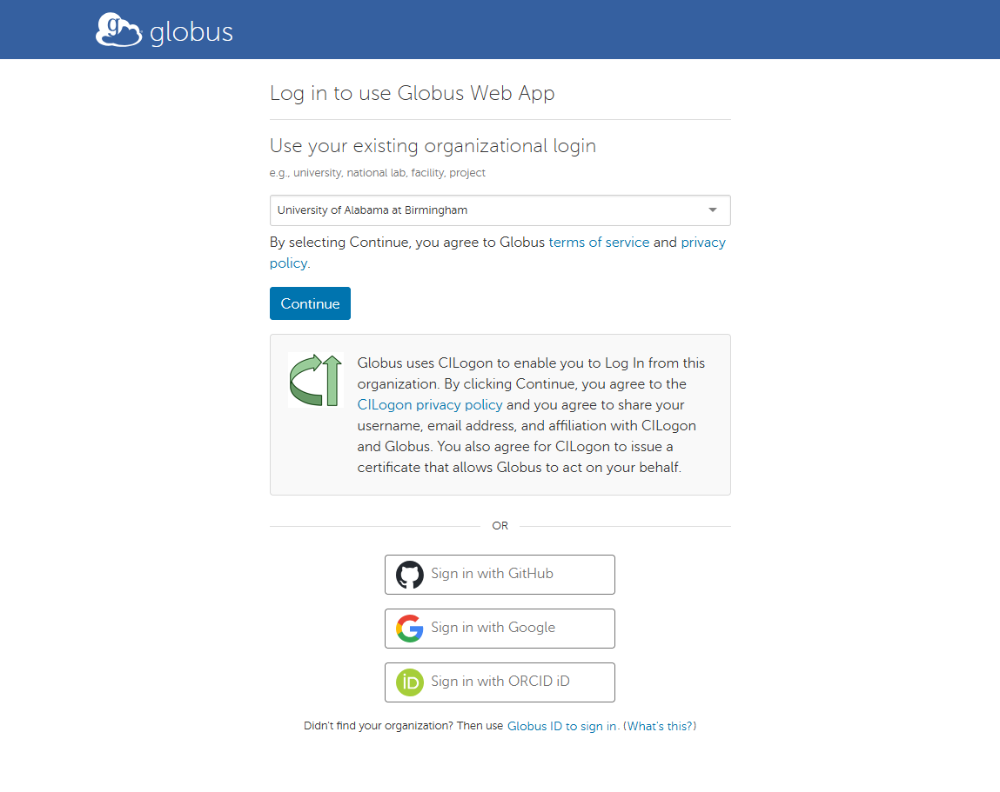
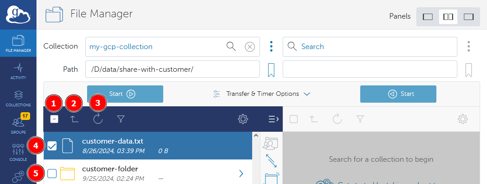
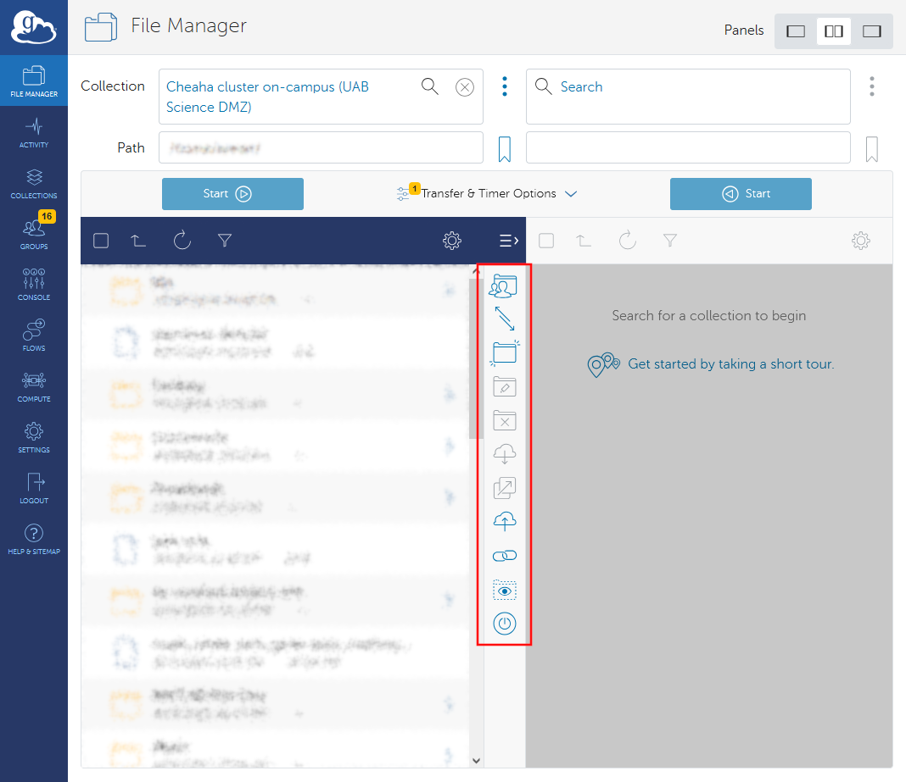
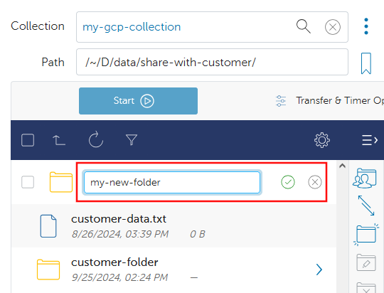
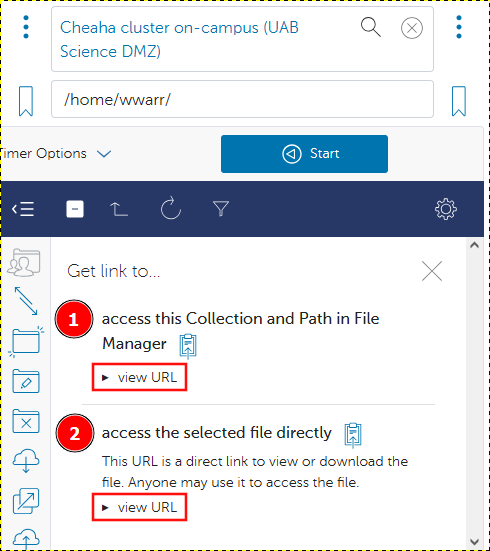
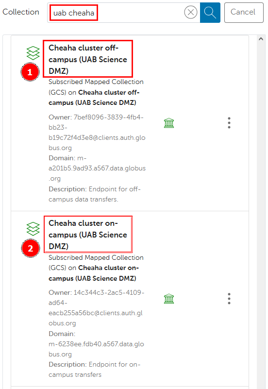
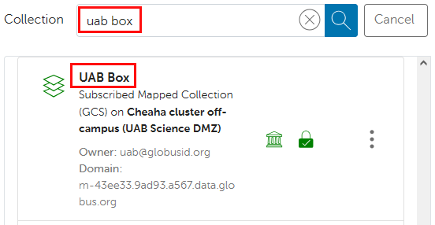
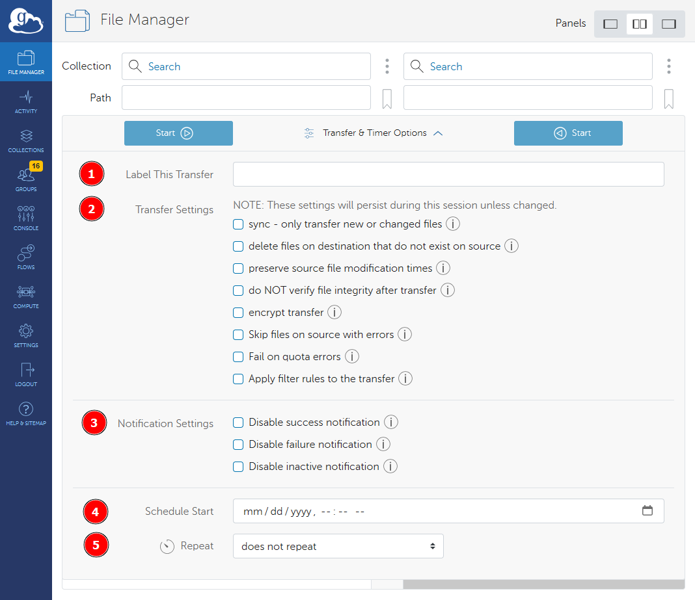

# Globus Tutorials for Individual Researchers

Do you have data and need to move it to a different computer system? Want to use a graphical interface to do it? Want a service that will attempt to resume interrupted transfers? Want enforced encryption for your transfers? Then Globus is right for you.

If you are new to Globus, you are in the right place. If you represent a group looking to share data with others we recommend following these tutorials with our [Globus Tutorials for Research Groups](./globus_organization_tutorial.md).

These tutorials are intended for individual researchers who need to move data from one location to another. If you manage a Research Core or lab and have never used Globus before, you'll want to start on this page. Then you will want to proceed to [Globus Tutorials for Research Groups](./globus_organization_tutorial.md).

The tutorials below will teach you how to effectively use Globus for managing and transferring research data. We will explore what Globus is, why you might use it, how it works, and we'll walk you through the essential steps to get started. You will learn how to set up your Globus account, access the Globus application, find Collections shared with you, and search for Collections by name.

Topics covered:

- [Why Globus?](#why-globus)
- [How Does Globus Work?](#how-does-globus-work)
- [Tutorial Prerequisites](#tutorial-prerequisites)
- Start Here
    - [How Do I Get Onto the Globus Web App?](#how-do-i-get-onto-the-globus-web-app)
    - [How Do I Use the File Manager Page?](#how-do-i-use-the-file-manager-page)
    - [How Do I Modify Files and Folders?](#how-do-i-modify-files-and-folders)
- Collections
    - [How Do I Search for Collections by Name?](#how-do-i-search-for-collections-by-name)
    - [How Do I Find UAB Storage Collections?](#how-do-i-find-uab-storage-collections)
    - [How Do I Find Collections Shared with Me?](#how-do-i-find-collections-shared-with-me)
- Transfers
    - [How Do I Transfer between a Collection and Cheaha?](#how-do-i-transfer-between-a-collection-and-cheaha)
    - [How Do I Transfer between a Collection and LTS?](#how-do-i-transfer-between-a-collection-and-lts)
    - [How Do I Transfer between LTS and Cheaha?](#how-do-i-transfer-between-lts-and-cheaha)
    - [How Do I Check Transfer Status?](#how-do-i-check-transfer-status)
    - [How Do I Configure Transfer Options?](#how-do-i-configure-transfer-options)
        - [How Do I Make the Destination Match the Source for a Transfer?](#how-do-i-make-the-destination-match-the-source-for-a-transfer)
        - [How Do I Schedule a Periodic Transfer or Backup?](#how-do-i-schedule-a-periodic-transfer-or-backup)

## Why Globus?

Globus is a data transfer ecosystem that simplifies the process of transferring, sharing, and managing large datasets. It is used by research institutions around the world to move research data between different storage devices, computer systems, and institutions. Globus has many research data oriented features, making it ideal for many research data transfer scenarios. Below is a list of features.

- Straight-forward, browser-based, graphical interface.
- Compatible with [UAB Box](https://www.uab.edu/it/home/tech-solutions/file-storage/box).
- Compatible with [Long-Term Storage](../../lts/index.md).
- Can be used with your laptop, desktop, or lab workstation via Globus Connect Personal (GCP).
- Transfers are automatically retried in the event of network or computer system outages.
- Transfers are encrypted end-to-end. Globus never sees your data.
- Suitable for transferring PHI and HIPAA data. Note: a UAB Enterprise IT risk assessment is required.

## How Does Globus Work?

Globus is an ecosystem of software intended to make research data transfer simpler. The Globus Web Application (Web App) at <https://app.globus.org> allows you to initiate transfers between any two Collections you have authorization to access. The Globus Connect Personal (GCP) software lets you turn any computer into a Globus Collection. At no point do Globus servers touch your research data. Instead, when you initiate a transfer between two Collections, the Globus application tells the two Collections that they need to talk to each other and data is sent directly between them. The Collections update the application with information you may need to know, such as how much data has transferred so far, how fast the transfer is proceeding, and any errors that occur. If the connection between Collections is interrupted for any reason, the Globus application will attempt to restart the transfer from where it left off.

## Tutorial Prerequisites

For these tutorials, you will need your BlazerID or [XIAS ID](../../../account_management/xias/index.md) and password to authenticate using UAB Single Sign-On (SSO).

## How Do I Get Onto the Globus Web App?

1. Use your browser to navigate to <https://app.globus.org>. You should see a login page like below.

    

1. To login, first you must find and select our institution. Type "UAB" or "University of Alabama at Birmingham" into the search bar to locate UAB in the list. The image below shows the correct choice in a red box.

    <!-- markdownlint-disable MD046 -->
    !!! note

        If you are an external collaborator using a [XIAS account](../../../account_management/xias/index.md) (this is uncommon) to interact with UAB-owned storage you will still need to search for "UAB". Do not use your home institution login to access UAB storage systems, as you will only have access to UAB storage with your XIAS credentials.
    <!-- markdownlint-enable MD046 -->

    

1. Select "University of Alabama at Birmingham" from the drop-down menu.

    

1. Click "Continue" to be taken to the UAB Single Sign-On (SSO) form. Enter your BlazerID and password in the SSO form, then click "Log In". Complete the login process as usual.

    

1. You should be taken to the File Manager page of the Globus Web App. We will be revisiting this page frequently throughout the tutorials. We highly recommend taking some time to familiarize yourself with the page as you proceed. The next few steps outline the important features of the File Manager page and its purpose. Please read on to learn [How To Use the File Manager Page](#how-do-i-use-the-file-manager-page)

    

- [How Do I Use the File Manager Page?](#how-do-i-use-the-file-manager-page)
- [Return to the top](#globus-tutorials-for-individual-researchers).

## How Do I Use the File Manager Page?

1. [Get Onto the Globus Web App](#how-do-i-get-onto-the-globus-web-app).
1. Recall that Globus is a data transfer application. Transferring data means moving data between two computers: source and destination. As we learn more about Globus, data stored on the source and destination will be visible on the File Manager page panels.

    By default, only one panel is visible. We recommend selecting two-panel view mode for improved ease of use. Select two-panel view mode by clicking the button located near the top right corner, as shown in the red box below. Of the three available view mode buttons, the two-panel view mode button is in the center.

    From here on, all tutorials will assume you are using two-panel view mode when we refer to the File Manager page.

    

1. Now that two-panel view mode has been selected, you will see two sets of features and panels side-by-side. Most of these features will be used extensively when using Globus.

    - **(1) Collection Search bar**: Clicking here will open the Collection Search page, allowing you to find Collections of data shared by others, or find your own Collections. The next step will demonstrate features of the Collection Search page.
    - **(2) Path text field**: After a Collection has been selected using (1), this text field allows you to enter the path to a specific folder, updating the files and folders shown in (5).
    - **(3) Start Transfer button**: When you have selected files and folders in (5), use this button to start transferring.
    - **(4) Transfer Options drop down menu**: Various options for the transfer are available in this menu. These options are not commonly needed and are not used in the tutorials.
    - **(5) File Browser panel**: After a Collection has been selected in (1), a list of files and folders will appear here for the path shown in (2). You may navigate the Collection here like you would on your operating system.
    - **(6) Navigation panel**: The blue bar at the left hand side of the Globus Web App is the navigation panel. It will be referred to and used many times throughout these tutorials.

    

1. To better prepare you for what to expect, the screenshot below shows the File Manager page with an example Collection selected, called "my-gcp-collection". This example shows a path in the Path text field and contents in the File Browser panel.

    - **(1) Select All checkbox**: Select or unselect all files in the currently displayed folder.
    - **(2) Go Up One Level button**: Go to the folder containing the currently displayed folder.
    - **(3) Refresh button**: Refreshes the view of the currently displayed folder.
    - **(4) File Selection checkbox**: If checked, then the file is selected for transfer. This file is selected.
    - **(5) Folder Selection checkbox**: If checked, then the folder is currently selected for transfer. This folder is not selected.

    

## How Do I Modify Files and Folders?

Globus provides controls for working directly with files and folders in Collections. These controls are found between the two panels, as shown in the image below. Descriptions of each button are given below the image.

- **(1) Share**: [Click to share the current folder as a Collection](./globus_organization_tutorial.md#how-do-i-share-a-collection-with-others).
- **(2) Transfer or Sync to**: Click to switch to the other panel.
- **(3) New Folder**: Click to creates a new folder in the current folder. The collection must have writing enabled and you must have write permissions to do this. At the top level of [LTS](../../lts/index.md), [special rules apply to names](../../lts/lts_faq.md#what-are-valid-bucket-names-in-lts).
    1. After clicking, a set of controls will appear in the panel.

        

    1. Type the name of the new folder in the provided text box.
    1. Click the circled green checkmark to create the folder, or the circled gray "x" to cancel.
    1. If an error occurs, a red text box will appear in place of these controls. Because the text can be long and the text box area small, you may need to scroll right in the error reporting box to read the full text. Generally the last part of the text is the most helpful.
        - Common LTS errors:
            - Starting with `Remote Endpoint Failure: Path already exists...`. The full error text contains `Message: Path ... already exists`. This means the bucket name is already in use. You must either choose another name, or [append a UUID](../../lts/lts_faq.md#what-are-valid-bucket-names-in-lts)
            - Starting with "Bad Gateway: Endpoint Error, Error (mkdir)...". The full error text contains `Error access "": ErrorInvalidBucketName: ErrorInvalidBucketName: \r\n`. This means the bucket name is not valid. You will need to change the name according to [the rules of bucket naming](../../lts/lts_faq.md#what-are-valid-bucket-names-in-lts).
- **(4) Rename**: Only enabled when a file or folder is selected. Click to rename the selected file or folder.
- **(5) Delete**: Only enabled when a file or folder is selected. Click to delete the selected file or folder. If a folder is deleted, everything it contains is deleted as well. This cannot be undone.

    <!-- markdownlint-disable MD046 -->
    !!! danger

        Using the Delete control in Globus is highly destructive and cannot be undone. Deleted files and folders cannot be recovered.
    <!-- markdownlint-enable MD046 -->

- **(6) Download**: Only enabled when a single file is selected. Only enabled on endpoints that support HTTPS access. Click to download the selected file to your computer. Prefer to use Globus Data Transfers to transfer files to your computer, rather than downloading directly. Direct downloads are slower and less robust than data transfers. See [Globus Connect Personal](./globus_organization_tutorial.md#how-do-i-install-globus-connect-personal) for more information on enabling transfers with your computer.
- **(7) Open**: Only enabled when a single file is selected. Only enabled on endpoints that support HTTPS access. Click to open the selected file using your browser. Opening files will only work if your browser knows how to handle the file type.
- **(8) Upload**: Only enabled on endpoints that support HTTPS access. Click to upload a file from your computer to the current folder. Prefer to use Globus Data Transfers to transfer files to your computer, rather than uploading directly. Direct uploads are slower and less robust than data transfers. See [Globus Connect Personal](./globus_organization_tutorial.md#how-do-i-install-globus-connect-personal) for more information on enabling transfers with your computer.
- **(9) Get Link**: Click to get two types of links (URLs). The links provide a convenient way to direct people to specific data resources. Links do not give special privileges nor give access. People you share the link with must already have access to the Collection you create the link from.

    To view the links, click the "view URL" foldout buttons highlighted in the image below. You can also use the "clipboard" icons to copy the link to the clipboard on your computer to paste elsewhere.

    An image of the controls is provided below, with a description following the image.

    

    1. Link to the current folder.
    1. Link to the currently selected file. Only enabled on endpoints that support HTTPS access. The link works the same way as using the (7) Open button.
- **(10) Manage Access Consent**: Only enabled on endpoints that support HTTPS access. Change what actions the current Collection is consented to perform on your behalf.

    An example of the "Manage Access Consent" page is shown below.

    

The File Manager page will be your most frequently-visited page when using Globus for data transfers. It is central to usage of the Globus Web Application. Please take some time to familiarize yourself with its look and feel. As you progress in the tutorials, please take time to experiment with transferring data to better understand how the interface works. Feel free to return to this section for guidance.

- [Return to the Top](#globus-tutorials-for-individual-researchers)

## How Do I Search For Collections By Name?

Please follow these instructions to search for a specific Collection by name.

1. [Get onto the Globus Web App](#how-do-i-get-onto-the-globus-web-app).
1. You should see the File Manager page. If not click File Manager in the left-hand navigation panel.

    

1. Click the Collection Search bar to open the Collection Search page.

    

1. In the example below, we typed "uab box" to search for the UAB Box Collection, which connects to UAB's Box.com service.

    

1. Click the name of the Collection to be taken back to the file manager page with the Collection filled in.

    

If you can't find a particular Collection this way, but know it was shared with you, try [finding Collections shared with me](#how-do-i-find-collections-shared-with-me). Proceed on to learn [how to find UAB storage Collections](#how-do-i-find-uab-storage-collections).

[Return to the top](#globus-tutorials-for-individual-researchers).

## How Do I Find UAB Storage Collections?

UAB offers [multiple storage resources](../../storage.md). The following resources may be accessed through Globus Collections.

- Cheaha file system (GPFS) including [individual directories](../../storage.md#what-individual-storage-solutions-are-available) and [project directories](../../storage.md#project-directory).
- [Long-Term Storage (LTS)](../../lts/index.md).
- [UAB Box](https://www.uab.edu/it/home/tech-solutions/file-storage/box).

To find these resources on Globus, use the following steps.

1. [Get onto the Globus Web App](#how-do-i-get-onto-the-globus-web-app).
1. You should see the File Manager page. If not click File Manager in the left-hand navigation panel.

    

1. Click the Collection Search bar to open the Collection Search page.

    

1. In the search bar, type one of the following, depending on which resource you need, and select the appropriate entry.

    - **Cheaha Filesystem (GPFS)**: Type "UAB Cheaha". There are two Collections, choose one based on where the other computer is located.
        - **(1)** Transferring with a computer on the UAB Campus Network or UAB Wifi? Select "Cheaha cluster **on**-campus (UAB Science DMZ)".
        - **(2)** Transferring with a computer on other networks? select "Cheaha cluster **off**-campus (UAB Science DMZ)".

        

    - **Long-Term Storage (LTS)**: Type "UAB LTS" and select the entry labeled "UAB Research Computing LTS (Long Term Storage aka S3)".

        

    - **UAB Box**: Type "UAB Box" and select the entry labeled "UAB Box".

        

Proceed on to learn [how to find Collections shared with you](#how-do-i-find-uab-storage-collections).

[Return to the top](#globus-tutorials-for-individual-researchers).

## How Do I Find Collections Shared with Me?

Globus allows users to share Collections with others. Other researchers, labs, and Research Cores on campus may invite you to their Collections to share data with you. The following instructions let you view Collections shared with you.

1. [Log in to Globus using your credentials](#how-do-i-get-onto-the-globus-web-app)
1. You should see the File Manager page. If not click File Manager in the left-hand navigation panel.

    

1. Click the Collection Search bar to open the Collection Search page.

    

1. Click the Shared With You tab. The list of Collections will be filtered down to all Collections others have granted you access to, which should help you find the Collections you need.

    

1. Click the name of the Collection to be taken back to the file manager page with the Collection filled in.

    

If you can't find a particular Collection this way, but know its name, try [searching for Collections](#how-do-i-search-for-collections-by-name).

Proceed on to learn how to transfer between Collections.

- [Between a Collection and Cheaha](#how-do-i-transfer-between-a-collection-and-cheaha)
- [Between a Collection and LTS](#how-do-i-transfer-between-a-collection-and-lts)
- [Between LTS and Cheaha](#how-do-i-transfer-between-lts-and-cheaha)

[Return to the top](#globus-tutorials-for-individual-researchers).

## How Do I Transfer between a Collection and Cheaha?

Please use the following instructions to transfer data from a shared Collection to [Cheaha GPFS](../../storage.md#what-type-of-storage-do-i-need). These instructions may also be used for other buckets on LTS, provided you have access and know their file path.

The direction of transfer may also be reversed to transfer data from Cheaha to the shared Collection. Note that some shared Collections may not allow you to transfer data back, such as some of those provided by Research Cores.

These instructions can be generalized to any two Collections you have access to on Globus.

1. [Log in to Globus using your credentials](#how-do-i-get-onto-the-globus-web-app).

1. Find a shared Collection [by filtering](#how-do-i-find-collections-shared-with-me) or [by searching](#how-do-i-search-for-collections-by-name) in the left side Collection Search bar.

1. Once you have selected the shared Collection you wish to transfer data from, repeat the process to [search](#how-do-i-search-for-collections-by-name) for a Cheaha Collection in the Collection Search bar on the right side of the file manager page. Search for "Cheaha cluster" to find them.

    Pay close attention in choosing which of the two you need. Choosing incorrectly could lead to slow transfers. Answer the following questions to help you decide. Is the first Collection you selected...

    - ...part of a lab or Research Core on campus? Select "on-campus".
    - ...on a computer on the UAB Campus Network or UAB Wifi or the UAB VPN? Select "on-campus".
    - ...at a different institution? Select "off-campus".
    - ...on a computer on a home network? Select "off-campus".

1. When you select a Cheaha Collection, or any other High Assurance (HA) Collection or Collection, you will be prompted to re-authenticate. Click the Continue button to do so, then select your UAB email address.

    

    

1. At this point, your file manager page should look something like the following image. At this point, both Collection Search bars should have a Collection or Collection filled in. The left side should be the Collection you wish to transfer from. The right side should be a Cheaha Collection. You should see files and folders on both sides.

    

1. Locate the source path on the shared Collection side. Either type the path into the Path field manually, or use the graphical selection field to click on folder names to navigate the filesystem.

1. Repeat the process on the Cheaha Collection side to locate the destination path on the Cheaha Collection side.

1. Select the file and folders you wish to transfer on the shared Collection side. Do so by clicking the checkboxes next to the file and folder names.

    

1. To start the transfer, click the "Start" button on the side you made your selections. A transfer will be started and you should see a green toast notification at the upper-right corner of the web page. Press the "X" button to dismiss the notification or click "View Details" to be taken to the Activity page to see more details about the transfer.

    

From here you can proceed to other related tutorials to initiate other transfers or
[return to the index](#globus-tutorials-for-individual-researchers).

- [How Do I check transfer status?](#how-do-i-check-transfer-status)
- [How Do I Transfer Between a Collection and LTS?](#how-do-i-transfer-between-a-collection-and-lts)
- [How Do I Transfer Between LTS and Cheaha?](#how-do-i-transfer-between-lts-and-cheaha)

[Return to the top](#globus-tutorials-for-individual-researchers).

## How Do I Transfer between a Collection and LTS?

Please use the following instructions to transfer data from a shared Collection to a [bucket on LTS](../../lts/index.md). These instructions may also be used for other directories on Cheaha, provided you have access and know their file path.

The direction of transfer may also be reversed to transfer data from LTS to the shared Collection. Note that some shared Collections may not allow you to transfer data back, such as some of those provided by Research Cores.

These instructions can be generalized to any two Collections or Collections you have access to on Globus.

1. [Log in to Globus using your credentials](#how-do-i-get-onto-the-globus-web-app).

1. Find a shared Collection [by filtering](#how-do-i-find-collections-shared-with-me) or [by searching](#how-do-i-search-for-collections-by-name) in the left side Collection Search bar.

1. Once you have selected the shared Collection you wish to transfer data from, repeat the process to [search](#how-do-i-search-for-collections-by-name) for the LTS Collection in the Collection Search bar on the right side of the file manager page. Search for "UAB LTS" to find it.

1. When you select the LTS Collection, or any other High Assurance (HA) Collection or Collection, you will be prompted to re-authenticate. Click the "Continue" button to do so, then select your UAB email address.

    

    

1. At this point, your file manager page should look something like the following image. Both Collection Search bars should have a Collection or Collection filled in. The left side should be the Collection you wish to transfer from. The right side should be the Cheaha Collection. You should see files and folders on both sides.

    

1. Locate the source path on the shared Collection side. Either type the path into the Path field manually, or use the graphical selection field to click on folder names to navigate the filesystem.

1. Repeat the process on the LTS Collection side to locate the destination path on the LTS Collection side.

1. Select the file and folders you wish to transfer on the shared Collection side. Do so by clicking the checkboxes next to the file and folder names.

    

1. To start the transfer, click the "Start" button on the side you made your selections. A transfer will be started and you should see a green toast notification at the upper-right corner of the web page. Press the "X" button to dismiss the notification or click "View Details" to be taken to the Activity page to see more details about the transfer.

    

From here you can proceed to other related tutorials to initiate other transfers or
[return to the index](#globus-tutorials-for-individual-researchers).

- [How do I check transfer status?](#how-do-i-check-transfer-status)
- [How Do I Transfer Between a Collection and Cheaha?](#how-do-i-transfer-between-a-collection-and-cheaha)
- [How Do I Transfer Between LTS and Cheaha?](#how-do-i-transfer-between-lts-and-cheaha)

[Return to the top](#globus-tutorials-for-individual-researchers).

## How Do I Transfer between LTS and Cheaha?

Please use the following instructions to transfer data from a [bucket on LTS](../../lts/index.md) to a project directory on Cheaha. These instructions may also be used for other buckets on LTS and directories on Cheaha, provided you have access and know their file paths.

The direction of transfer may also be reversed to transfer data from Cheaha to LTS.

These instructions can be generalized to any two Collections or Collections you have access to on Globus.

1. [Log in to Globus using your credentials](#how-do-i-get-onto-the-globus-web-app).

1. Find the LTS Collection by [searching](#how-do-i-search-for-collections-by-name) in the Collection Search bar on the left side of the file manager page. Search for "UAB LTS" to find it.

1. Once you have selected the LTS Collection, repeat the process to [search](#how-do-i-search-for-collections-by-name) for a Cheaha Collection in the Collection Search bar on the right side of the file manager page. Search for "Cheaha cluster" to find it.

    Pay close attention in choosing which of the two you need. Choosing incorrectly could lead to slow transfers. Answer the following questions to help you decide. Is the first Collection you selected...

    - ...part of a lab or Research Core on campus? Select "on-campus".
    - ...on a computer on the UAB Campus Network or UAB Wifi or the UAB VPN? Select "on-campus".
    - ...at a different institution? Select "off-campus".
    - ...on a computer on a home network? Select "off-campus".

1. Both the LTS and Cheaha Collections are High Assurance (HA) Collections and you will be prompted to re-authenticate. Click the "Continue" button to do so, then select your UAB email address.

    

    

1. At this point, your file manager page should look something like the following image. Both Collection Search bars should have a Collection or Collection filled in. The left side should be the LTS Collection. The right side should be a Cheaha Collection. You should see files and folders on both sides.

    

1. Locate the source path on the LTS Collection side. Either type the path into the Path field manually, or use the graphical selection field to click on folder names to navigate the filesystem.

1. Repeat the process on the Cheaha Collection side to locate the destination path on the Cheaha Collection side.

1. Select the file and folders you wish to transfer on the shared Collection side. Do so by clicking the checkboxes next to the file and folder names.

    

1. To start the transfer, click the "Start" button on the side you made your selections. A transfer will be started and you should see a green toast notification at the upper-right corner of the web page. Press the "X" button to dismiss the notification or click "View Details" to be taken to the Activity page to see more details about the transfer.

    

From here you can proceed to other related tutorials to initiate other transfers or
[return to the index](#globus-tutorials-for-individual-researchers).

- [How do I check transfer status?](#how-do-i-check-transfer-status)
- [How Do I Transfer Between a Collection and Cheaha?](#how-do-i-transfer-between-a-collection-and-cheaha)
- [How Do I Transfer Between a Collection and LTS?](#how-do-i-transfer-between-a-collection-and-lts)

[Return to the top](#globus-tutorials-for-individual-researchers).

## How Do I Check Transfer Status?

To check the status of your transfers, please follow the instructions below.

1. [Log in to Globus using your credentials](#how-do-i-get-onto-the-globus-web-app).

1. In the Globus Web App, click "Activity" in the left navigation panel to go to the Activity page. There will be a list overview of transfers, with the most recent at the top.

    

1. To see more details about a transfer, click the transfer title. There will be two tabs. The Overview tab will have information and statistics about the transfer. The Event Log tab will have information about events that occurred during transfer, including start, stop, and any errors. The Event Log is useful for diagnosing issues with failed transfers.

    

[Return to the top](#globus-tutorials-for-individual-researchers).

## How Do I Configure Transfer Options?

Globus provides options for Transfers and Timers. These options allow you to modify how transfers are performed, or allow you to schedule transfers for future times.

Click "Transfer & Timer Options" button to unfold and view the menu.

Most of the options have a circled lower-case letter "i" icon `(i)` to the right of the description. Click the icon to get more information about that option. More information about each option is provided after the image below.

- **(1) Label This Transfer**: Provide a meaningful, specific label for the transfer. Especially useful for recurring transfers.
- **(2) Transfer Settings**:
    - **sync...**: Check this box to sync files. Only new and changed files are transferred. This can help speed up transfers where many of the files already exist. When checked, a drop-down box will appear. The drop-down box has conditions to select which files to replace.
    - **delete...**: Delete files on the destination if they aren't part of the transfer. This will make the destination file and folder layout and content match the source. Deleted files cannot be recovered.

        <!-- markdownlint-disable MD046 -->
        !!! danger

            Using the "delete" transfer setting for a data transfer is highly destructive and cannot be undone. Deleted files and folders cannot be recovered.
        <!-- markdownlint-enable MD046 -->

    - **preserve...**: Preserves modification times of files. If this option is not checked (the default), then modification times are set to whenever the file or folder has finished transferring.
    - **do NOT verify...**: By default, Globus verifies the integrity of file contents by matching checksums. It is highly recommended to leave this box unchecked. Checking this box could lead to corruption of data without notice or warning.

        <!-- markdownlint-disable MD046 -->
        !!! important

            Do not check the "do NOT verify..." box unless instructed to do so.
        <!-- markdownlint-enable MD046 -->

    - **encrypt transfer...**: If checked, the transfer will be end-to-end encrypted. You must always check this box when working with any Research Data or Protected Health Information (PHI) per [UAB Policy](https://www.uab.edu/it/home/policies/data-classification/classification-overview). This box is checked by default when working with High Assurance (HA) Collections, including Cheaha and LTS, and cannot be unchecked.
    - **skip files...**: If checked, any missing or inaccessible files on the source will be skipped. If unchecked, missing and inaccessible files will cancel the transfer with an error.
    - **Fail on quota errors**: If checked, transfers exceeding the storage quota will fail instead of retrying.
    - **Apply filter rules...**: If checked, new controls will appear allowing you to add filter rules. Any filter rules added will be obeyed during the transfer. Read more about filter rules at the [Official Globus Documentation page](https://docs.globus.org/api/transfer/task_submit/#filter_rules).
- **(3) Notification Settings**: Each of these checkboxes disables a particular notification email.
- **(4) Schedule Start**: Choose a future date and time at which to start the transfer.
- **(5) Repeat**: Select whether, and how often, to repeat the transfer. When a drop down menu item is selected, additional controls appear. These controls allow you to select the frequency, and when to stop the repetition. An example is shown below, where the repetition is every 7 days until a specified date.

    

## How Do I Make the Destination Match the Source for a Transfer?

1. Get to the [Transfer Options](#how-do-i-configure-transfer-options).
1. Check the "delete...", and "preserve..." checkboxes.
1. Initiate the transfer as usual.

## How Do I Schedule a Periodic Transfer or Backup?

1. Get to the [Transfer Options](#how-do-i-configure-transfer-options).
1. Choose a meaningful name for "Label This Transfer". This will help identify the periodic transfer and its purpose later, if you need to cancel it.
1. If the periodic transfer is for backup purposes, consider using the "sync..." settings to improve performance, and the "preserve..." option to ensure that modification times are saved for future restoration. Use the "delete..." option at your discretion.
1. Choose a date and time in "Schedule Start".
1. Choose a "Repeat" option.
1. Initiate the transfer as usual.

<!-- markdownlint-disable MD046 -->
!!! warning

    Cheaha, LTS and UAB Box are not intended as backup services. Cheaha storage is intended for data being used in active research. LTS is intended for the long-term storage of research data that is not being actively used in research.
<!-- markdownlint-enable MD046 -->
